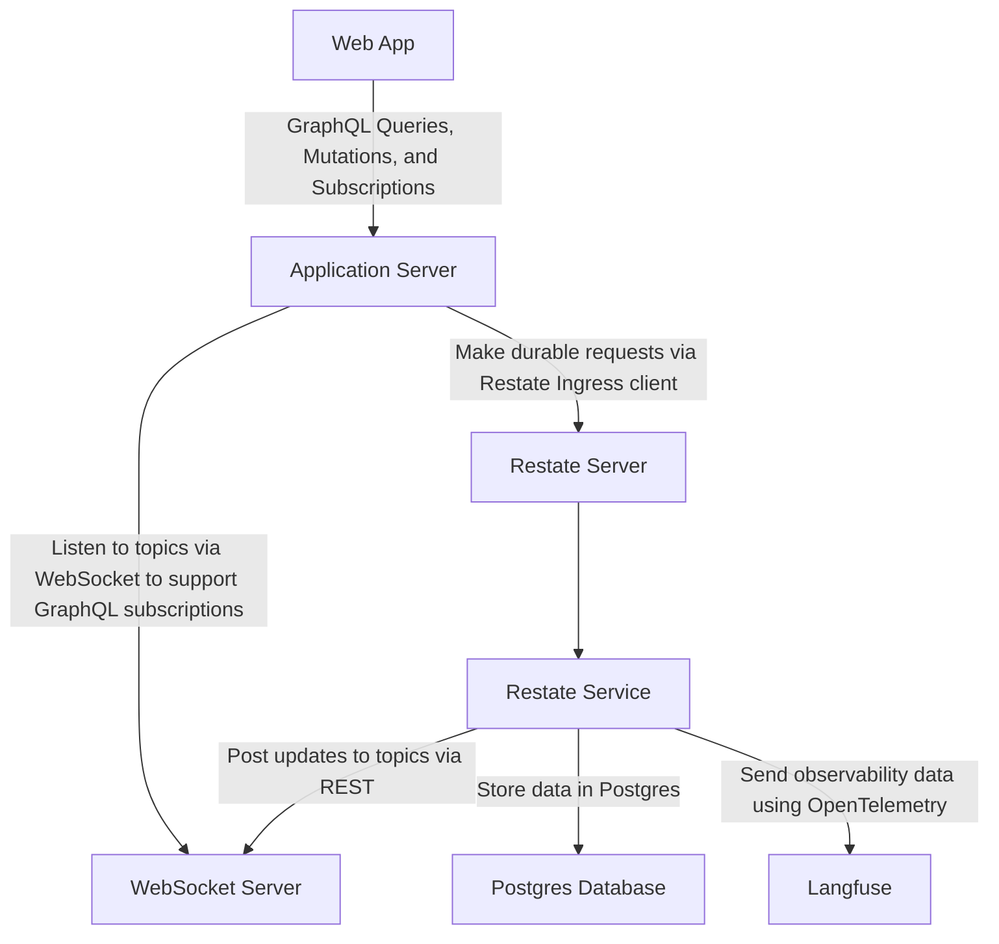

# 🦎 Reptyl Stack Template

## Introduction

The Reptyl Stack Template is a template for building AI applications backed by durable agents. It gets its name from:

- **Re**state: the durable execution engine supporting long-running agentic AI workflows and human-in-the-loop interactions.
- **P**ostgres: the database used to store application data.
- **T**ypeScript: the programming language for the frontend and backend code.
- **L**angfuse: the observability platform for tracing and monitoring AI applications.

The Reptyl Stack prioritizes robust and scalable AI applications that are easy to develop and maintain. It also focuses
on providing a great developer experience, with a strong emphasis on type safety and hot reloading during development.

It also uses a number of other tools and libraries to enhance the development process and improve the overall quality
of the applications built with it.

### Development Tools

- Turborepo: a high-performance build system for JavaScript and TypeScript monorepos.
- Vitest: a fast and reliable test runner for JavaScript and TypeScript.
- Prettier: a code formatter that enforces a consistent style across the codebase.
- ESLint: a static code analysis tool for identifying and fixing problems in JavaScript and TypeScript code.
- Vite: a fast and lightweight development server for building modern web applications.
- Sqitch: a database change management tool that helps manage database schema changes in a structured way.
- Husky: a tool for managing Git hooks, allowing you to run scripts before committing or pushing code.

### Libraries

- Express: a web application framework for Node.js, designed for building APIs and web applications.
- React: a JavaScript library for building user interfaces, used in the frontend applications.
- Vercel AI SDK: a library for building AI applications with a focus on ease of use and performance.
- Apollo GraphQL Server: a library for building GraphQL APIs with a focus on performance and developer experience.
- Apollo Client: a library for consuming GraphQL APIs in frontend applications.
- TypeORM: an ORM for TypeScript and JavaScript that supports various databases, including Postgres.
- OpenTelemetry: a set of APIs, libraries, agents, and instrumentation to provide observability for applications, which is
  supported by Vercel AI SDK and Langfuse.
- Zod: a TypeScript-first schema declaration and validation library that provides a powerful way to define and validate
  data structures.
- pino and pino-pretty: a fast and lightweight logging library for Node.js, with support for structured logging and
  pretty-printing in development.

## Architecture



The Web App (implemented by `@reptyl/webapp`) is a React Single Page Application (SPA) that communicates with the
Application Server (`@reptyl/application-server`) via GraphQL queries, mutations, and subscriptions. The Application Server
is built with Express and Apollo Server, and also responsible for serving the Web App.

The Application Server uses the Restate Ingress client to make durable requests to the Restate Server. In development,
the Restate Server runs in a Docker container. In production, the Restate Server can either be self-hosted or provided by
Restate Cloud.

The Restate Server orchestrates requests to the Restate Service and drives them to completion, ensuring durability. The
Restate Service is implemented in `@reptyl/restate-service`, which is a Node.js service that handles the business logic
and interacts with the Postgres database for data storage. It also sends observability data using OpenTelemetry to
Langfuse for monitoring and tracing.

To support real-time updates to the Web App, the Restate Service posts updates to topics to the WebSocket Server
(`@reptyl/ws-server`) via REST, which the Web App can subscribe to via a WebSocket connection. This allows the Web App
to serve real-time updates to the UI via GraphQL subscriptions.

The Postgres database model is implemented by the `@reptyl/persistence` package, which provides a repository pattern
implementation using TypeORM. The database schema is managed using Sqitch, which allows for versioned database migrations
and schema changes.

Domain models are implemented using Zod schemas in the `@reptyl/domain-model` package. Additionally, the API schemas
exposed by the Restate Service are also implemented using Zod, and `@reptyl/restate-service` is also built as a package
that is used by the `@reptyl/application-server` to invoke the Restate Services via the Restate Ingress client in a
type-safe manner.

## Getting Started

### Dependencies

#### Node.js

Firstly install Node.js using [nvm](https://github.com/nvm-sh/nvm?tab=readme-ov-file#installing-and-updating).
The version of Node.js required is specified in the `.nvmrc` file. Once you have set up `nvm`, you can run the
following command to install it, then set it as default:

```bash
nvm install
nvm alias default $(cat .nvmrc)
```

Finally, install the latest version of `npm` (v11.x is required at the time of writing):

```bash
npm install -g npm@latest
```

#### Docker

To run the Reptyl Stack, you will need to have Docker installed. You can follow the instructions on the
[Docker website](https://docs.docker.com/get-docker/) to install Docker on your machine.

#### Sqitch

To manage database schema changes, you will need to have Sqitch installed. You can follow the instructions on the
[Sqitch website](https://sqitch.org/download/) to install Sqitch on your machine.

#### Langfuse

To use Langfuse for observability, you will need to set up a Langfuse account and obtain an API key. Although it is
possible to run Langfuse inside Docker, this consists of several containers and therefore this setup uses Langfuse
Cloud for simplicity. You can sign up for a free account on the [Langfuse website](https://www.langfuse.com/).

#### Anthropic API Key

The sample application uses the Anthropic API for AI capabilities. You will need to set up an account with
[Anthropic](https://www.anthropic.com/) and obtain an API key.

### Cloning the Repository

At the time of writing, the Reptyl Stack is not yet available via `npm`, so it's necessary to clone the repository
directly from GitHub and grabbing the latest version of the template:

```bash
git clone https://github.com/anton-pt/reptyl-stack.git reptyl-tmp
mkdir my-reptyl-app
mv reptyl-tmp/template/* my-reptyl-app
rm -rf reptyl-tmp
```

### Installing Dependencies

Once you have cloned the repository, navigate to the `my-reptyl-app` directory and install the dependencies:

```bash
cd my-reptyl-app
npm install
```

### Setting Up Environment Variables

You will need to set up the environment variables required by the Reptyl Stack. Copy the `.env.example` files in
the directories `apps/restate-service` and `apps/application-server` to `.env` files in the same directories.
Then, edit the `.env` files to fill in the required values.

### Running the Application

To run the Reptyl Stack in local development mode, you can simply use the following command:

```bash
npm run dev
```

This will start the Application Server, the Restate Server, and the WebSocket Server, and serve the Web App on
`http://localhost:5173`. The Application Server will also be available on `http://localhost:8081`, and GraphQL
API endpoints will be proxied by the Vite development server at `http://localhost:5173/api/graphql`.

You should now be able to navigate to this URL in your web browser and see the Reptyl Stack Web App running.
If you've configured your API keys correctly, you should be able to have simple chat conversations with the AI
assistant, and these should be persisted in the Postgres database and traced in Langfuse.

## Local Development

### Hot Reloading

The Reptyl Stack is designed to provide a great developer experience with hot reloading and type safety. The
development server is powered by Vite, which provides fast hot module replacement (HMR) for the frontend code.
The backend code (for the Application Server, Restate Service, and WebSocket Server) is also set up for hot
reloading using `ts-node` in `--watch` mode.

The packages that are part of the stack are also automatically rebuilt when you make changes to them, thanks to
Turborepo tasks.

File changes to the `@reptyl/restate-service` package will automatically trigger the service to be re-registered
with the Restate Server, so new APIs will immediately be available to the Application Server.

GraphQL schema and operation changes will also be automatically picked up by the Application Server and Web App.

### Debugging

There are VS Code launch configurations available for debugging the Application Server, Restate Service, and
WebSocket Server.

### Database Migrations

To manage database schema changes, the Reptyl Stack uses Sqitch. You can create a new migration using the
following command:

```bash
npm run sqitch add <migration-name> -n "<description>"
```

Sqitch migrations are automatically deployed by a Docker container that runs when `npm run dev` is executed.
You can also run Sqitch commands directly using `npm run sqitch <command>`, where `<command>` can be `deploy`,
`revert`, `status`, etc.

For additional information on how to use Sqitch, refer to the [Sqitch documentation](https://sqitch.org/docs/).
